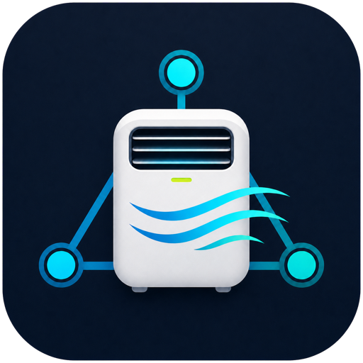

<p align="center">
  
</p>

<h1 align="center">Emerio Local</h1>

Experimentelle Home-Assistant-Integration für den Emerio PAC-127111.1 und
Klarstein-kompatible Tuya-3.4-Klimageräte mit Product-ID `bvgvah9atllpyt5s`.

## Warum eine eigene Integration?

Das untersuchte Gerät akzeptiert lokale Schreibbefehle, beantwortet die übliche
synchrone Tuya-Statusabfrage aber nicht zuverlässig. Andere Integrationen warten
auf genau diese Antwort, markieren das Gerät als offline oder verlieren nach
einem ausgeführten Befehl den Zustand.

Emerio Local hält stattdessen eine Tuya-3.4-Verbindung offen. Befehle,
Control-Antworten, spontane Push-Meldungen und Statusanfragen laufen dadurch über
denselben Socket. Erkannte Datenpunkte werden als echter Gerätestatus nach Home
Assistant übernommen. Nach einem Befehl fragt die Integration zusätzlich im
normalen und im von TinyTuya erkannten `device22`-Format nach.

Nur bis eine echte Rückmeldung eintrifft, zeigt Home Assistant den gesendeten
Wert als **optimistischen/angenommenen Zustand**. Das verhindert, dass die UI
nach einem erfolgreichen Einschalten weiter „Aus“ anzeigt und deshalb keinen
Ausschaltbefehl mehr anbietet.

## Features

- **Smart-Life-Onboarding mit QR-Code:** Device-ID und Local Key werden bei der
  Neueinrichtung automatisch über die offizielle Tuya-Device-Sharing-API
  abgerufen.
- **Lokaler Betrieb nach der Einrichtung:** Steuerung und Statuskommunikation
  laufen direkt zwischen Home Assistant und dem Klimagerät; die Tuya-Cloud wird
  dafür nicht benötigt.
- **Keine gespeicherten Cloud-Tokens:** Benutzercode, QR-, Access- und
  Refresh-Token existieren nur während des Einrichtungsdialogs.
- **Verlässliche Tuya-3.4-Verbindung:** Eine persistente Verbindung verarbeitet
  Befehlsantworten und spontane Gerätemeldungen über denselben Socket.
- **Vollständige Klimasteuerung:** Ein/Aus, Kühlen, Entfeuchten, Nur Lüften,
  16–31 °C Zieltemperatur sowie hohe und niedrige Lüfterstufe.
- **Zusatzfunktionen:** Schlafmodus, Timer von 0–24 Stunden und separater
  Power-Schalter als Fallback.
- **Firmwaregerechte Moduswechsel:** Nach dem Einschalten wartet die Integration
  auf die Power-Bestätigung und die notwendige kurze Geräte-Settle-Zeit.
- **Echte Zustandsrückmeldung:** Bestätigte Gerätewerte ersetzen automatisch den
  nur vorübergehend optimistischen UI-Zustand.
- **Robuster Reconnect:** Bei einem Verbindungsabbruch werden ausstehende
  Datenpunkte vorgemerkt und nach dem Wiederaufbau übertragen.
- **Erholung nach Netztrennung:** Ein nach Shelly- oder Stromtrennung veralteter
  Monitor wird durch eine echte Statusabfrage erkannt und sauber neu aufgebaut.
- **Diagnose in Home Assistant:** Statusquelle, Fehlercode, letzte Gerätewerte
  und ein manueller Button zum Aktualisieren des Status.
- **HACS-Updates mit Versionsnummern:** Veröffentlichte Releases werden als
  semantische Versionen statt als Commit-Hashes angeboten.

## Installation über HACS

1. In HACS oben rechts **Benutzerdefinierte Repositories** öffnen.
2. `https://github.com/MyNameIsRatchet/emerio-local` als Typ
   **Integration** hinzufügen.
3. **Emerio Local** herunterladen und Home Assistant vollständig neu starten.
4. Unter **Einstellungen → Geräte & Dienste → Integration hinzufügen** nach
   **Emerio Local** suchen.
5. **Smart-Life-gestützte Einrichtung** wählen. Alternativ können vorhandene
   Zugangsdaten weiterhin manuell eingegeben werden.
6. In der Smart-Life- oder Tuya-Smart-App unten rechts **Profil**, oben rechts
   **Einstellungen** und dann **Konto und Sicherheit → Benutzercode** öffnen.
7. Den Benutzercode in Home Assistant eingeben. Danach in der App
   **+ → Scannen** öffnen und den in Home Assistant angezeigten QR-Code scannen.
8. Das Klimagerät auswählen, die App vollständig beenden und die lokale
   Netzwerksuche starten. Abschließend die gefundene oder feste IP-Adresse
   bestätigen.
9. Andere lokale Tuya-Integrationen für dieses Gerät deaktiviert lassen.

HACS installiert die Integration nach
`/config/custom_components/emerio_local` und meldet neue veröffentlichte
Versionen als Update.

### Datenschutz beim Smart-Life-Onboarding

Die Cloud-Verbindung wird nur während des Einrichtungsdialogs verwendet, um
Gerätename, Device-ID und Local Key abzurufen. QR-Token, Access-Token,
Refresh-Token und Smart-Life-Benutzercode werden nicht in der Home-Assistant-
Konfiguration gespeichert. Der für die dauerhaft lokale Verbindung notwendige
Local Key bleibt – wie bei der manuellen Einrichtung – im Config Entry von Home
Assistant gespeichert. Nach der Einrichtung kommuniziert Emerio Local direkt
mit dem Klimagerät; für den Betrieb ist keine Tuya-Cloud-Verbindung erforderlich.

## Manuelle Installation

1. Den Ordner `custom_components/emerio_local` nach
   `/config/custom_components/emerio_local` in Home Assistant kopieren.
2. Home Assistant vollständig neu starten.
3. Unter **Einstellungen → Geräte & Dienste → Integration hinzufügen** nach
   **Emerio Local** suchen.
4. Name, feste IP-Adresse, Tuya Device ID und den 16-Byte Local Key eingeben.
5. Andere lokale Tuya-Integrationen für dieses Gerät deaktiviert lassen.

## Entitäten

- Climate: Ein/Aus, 16–31 °C, Kühlen, Entfeuchten, Lüften, High/Low, Sleep
- Power-Schalter als unabhängiger Fallback
- Schlafmodus-Schalter
- Timer 0–24 h
- Fehlercode (nur wenn eine Statusabfrage irgendwann funktioniert)
- Statusquelle (`unknown`, `optimistic`, `device`, `error`)
- Manueller Button **Status aktualisieren**

## Wichtige Grenze

`device` bedeutet: Mindestens ein bekannter Datenpunkt kam tatsächlich vom
Klimagerät. `optimistic` bedeutet: Home Assistant zeigt vorübergehend den zuletzt
gesendeten Wert, weil noch keine auswertbare Rückmeldung eingetroffen ist.

Die Integration lauscht auf spontane Meldungen und fragt alle 30 Sekunden sowie
nach jedem Befehl nach. Ob die spezielle Emerio-Firmware ihre Datenpunkte auf
dieser dauerhaften Verbindung vollständig liefert, muss einmal am echten Gerät
getestet werden. Die Bedienung bleibt auch dann möglich, wenn nur der
optimistische Fallback funktioniert.

## Logging

Für die Entwicklung vorübergehend in `configuration.yaml`:

```yaml
logger:
  logs:
    custom_components.emerio_local: debug
    tinytuya: debug
```

Der Local Key darf nie in Issues oder ungeschwärzten Logs veröffentlicht werden.

## Danksagung

Der Smart-Life-/QR-Onboarding-Ablauf basiert auf der MIT-lizenzierten Arbeit von
[`make-all/tuya-local`](https://github.com/make-all/tuya-local) und dem
offiziellen
[`tuya-device-sharing-sdk`](https://github.com/tuya/tuya-device-sharing-sdk).
